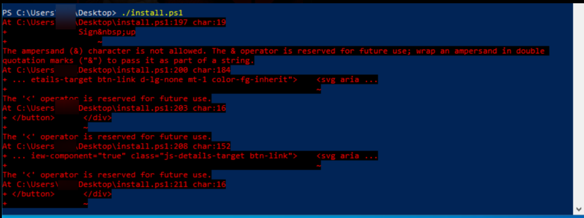
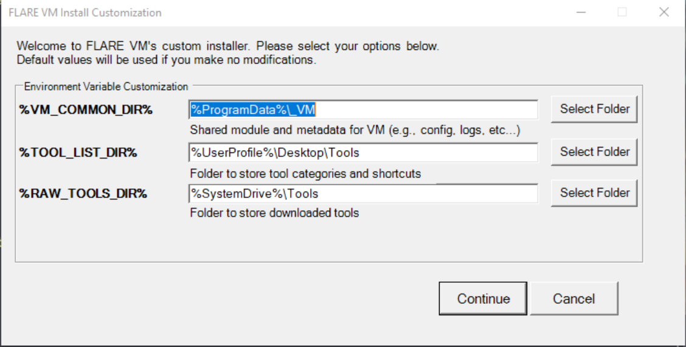

# FLARE-VM

[← Back to FAQ index](faq.md)

---

### General FLARE-VM setup: install time, errors, etc.

- Some errors are normal during install.
- Reboots are normal.
- If a few tools don’t install, you can install them manually; most will still install.
- Install can take a long time (e.g. a few hours even with fast internet).

---

### Do I need to disable AV before installing FLARE-VM?

The repo says to disable AV; it often works without that. If some tools fail to install because of AV, install those manually.

If Defender causes issues:
- Remove all Defender signatures (in an elevated PowerShell):

```powershell
& "C:\Program Files\Windows Defender\MpCmdRun.exe" -RemoveDefinitions -All
```

- Turn off Defender via Group Policy:  [Turn off Windows Defender using Group Policy](https://www.prajwaldesai.com/turn-off-windows-defender-using-group-policy/)

- Remove Defender entirely (last resort):  
  [John Hammond — Remove Defender](https://www.youtube.com/watch?v=81l__vvGnjA)

---

### FLARE-VM install script shows HTML / weird errors



You downloaded the GitHub webpage instead of the raw script. Use the raw URL:

- Raw install script:  <https://raw.githubusercontent.com/mandiant/flare-vm/main/install.ps1>

If you see HTML in the error, you did not get the raw resource.

---

### Defender says the install script is malicious and blocked it

If you got the script from the Mandiant FLARE-VM repo, it’s safe. Disable Windows Defender on the lab machine and run the script again. It’s acceptable to disable Defender on the FLARE-VM lab VM.

---

### Installation succeeded but many tools from the videos are missing

In December 2022 the FLARE team changed the installer and reduced the default tool set. Some tools shown in the course are no longer installed by default.

- Install missing tools yourself from their official repos; they’re all free and open source.
- The Course Tool List & Resources lecture (lab build section) has the full list and links.

---

### FLARE-VM reboots every hour

Usually caused by the Windows evaluation license expiring.

Options:
1. On FLARE-VM, open an elevated command prompt and run:

```cmd
slmgr /rearm
```

2. If that doesn’t fix it, rebuild FLARE-VM from scratch with the install script and a fresh Windows ISO.

---

### The FLARE-VM installation UI has changed




The installer UI changes over time but the steps stay similar. For the current version:

- The UI has two screens (see screenshots).
- Follow the course instructions and use the custom config in the install arguments.
- Choose Continue in both dialogs and the install will proceed.

---

### Binary Patching: The payload runs even when I didn’t patch it

Newer FLARE-VM installs often include the ScyllaHide plugin by default. It’s a countermeasure to anti-debugging and auto-patches known techniques. It is useful to learn in general but undermines the Binary Patching lesson.

Fix: In x64dbg go to Explorer → Plugins and disable ScyllaHide for that lesson.
