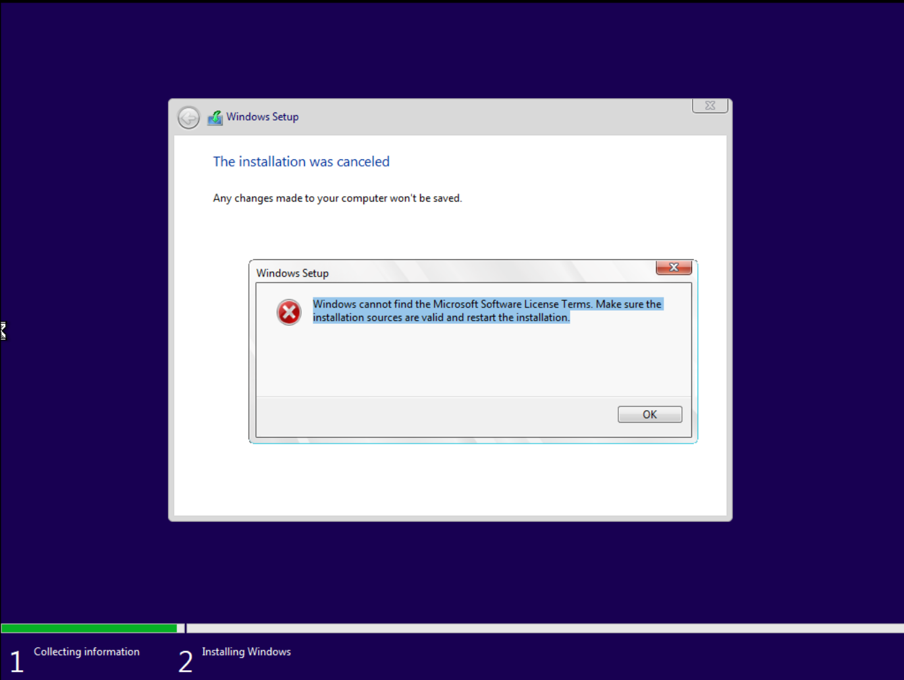

# Hypervisor & VMs

[← Back to FAQ index](faq.md)

---

### Can I use VMware or another hypervisor for the course?

I chose VirtualBox for the course because, at the time, it was one of the only free hypervisors that allows the user to take and revert to snapshots—which is important for malware analysis.

- If you have a hypervisor that supports snapshotting (e.g. VMware Workstation Pro) and know how to set up an isolated network, that’s fine.
- I will only support issues and troubleshooting for VirtualBox.

VMware Workstation Pro / Fusion are now free for personal and educational use, so they are a good free alternative if you prefer.

---

### Should I be worried about VM escape malware?

A: In the course, definitely not. There are no VM escape malware samples in this course. And in general, I would say no. While VM escape malware does technically exist and there are POCs out there, VM escape malware is so rare and requires such a specific set of facilitating factors that it is incredibly unlikely to occur. I'd rank it about as likely (and devastating) as a meteor strike.

Mitigation: Keep your hypervisor set to auto-update, or patch manually for each release.

---

### Can I leave drag and drop and shared clipboard enabled during malware analysis?

- During static analysis: Drag and drop can stay enabled.
- Before running any malware: Disable clipboard, disable drag and drop, and remove any shared folders between guest and host.

---

### I get this error when trying to install the Windows 10 ISO

Solution: Remove the Floppy Disk install media from the guest VM’s devices.
