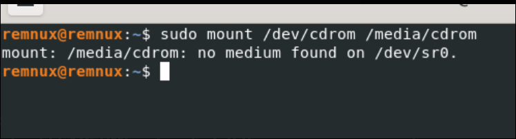
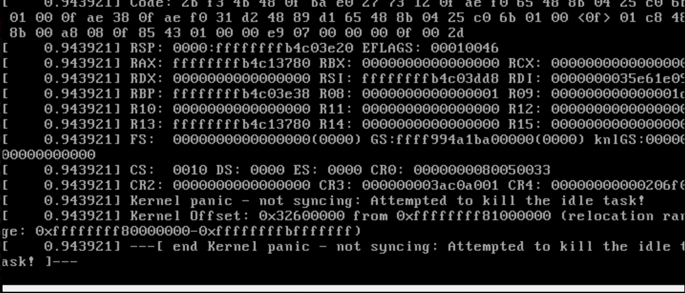

# REMnux

[← Back to FAQ index](faq.md)

---

### REMnux shows “Oh no! Something went wrong…” and won’t boot

You see: *"Oh no! Something went wrong. A problem has occurred and the system cannot recover. Please log out and try again."* After restart, REMnux reaches the login screen but still doesn’t boot.

Cause: Hyper-V is enabled on Windows and conflicts with VirtualBox.

Fix:
1. Open Turn Windows features on or off.
2. Uncheck Hyper-V.
3. Reboot the host.

---

### Error when setting up REMnux during “Installing REMnux”



Read the note above that video. If VM tools are already on REMnux (they are by default now), you can ignore this error and continue.

---

### REMnux kernel panics on boot



Fix: Give the VM more resources—add another CPU core and/or a few more GB of RAM.

---

### INetSim: something is bound to port 53, DNS doesn’t work


Something else is using port 53.

Option 1 — find and kill the process:
```bash
sudo netstat -plant
```

Find the process bound to port 53, then kill it.

Option 2 — free port 53 from systemd-resolved:
1. Edit `/etc/systemd/resolved.conf`.
2. Uncomment the `DNSStubListener=yes` line and set it to no.
3. Reboot REMnux.
