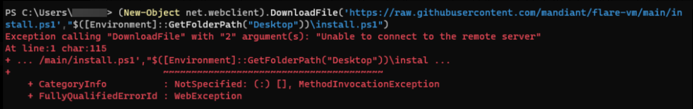

# Troubleshooting

[← Back to FAQ index](faq.md)

---

### Defender/AV on my physical host flagged my VM files as malicious

This is uncommon but can happen. Defender can trigger on files inside the VM (e.g. pattern matching on guest OS or disk images).

Recommendation:
- Add an antivirus exclusion for your VM directory (or the folder where you store VMs).
- Do not disable AV on your host entirely.

This is not evidence of VM escape. It’s likely the AV matching on VM disk/guest files.

---

### I can’t download the FLARE-VM installer script

*“Unable to connect to the remote server”* means the download couldn’t reach GitHub.

Possible causes:
- GitHub could be down (uncommon).
- Your ISP or something in the path is blocking GitHub.

Workaround: Try Tor or a VPN. If it works over a VPN, the block is likely on your ISP or network.

---

### TCM Security site issues (page won’t load, 503, etc.)

I don’t control the TCM platform. You can try:

- Another browser or incognito/private mode.

If the problem is on the site side, you’ll need to contact TCM:

- Email: support@tcm-sec.com
